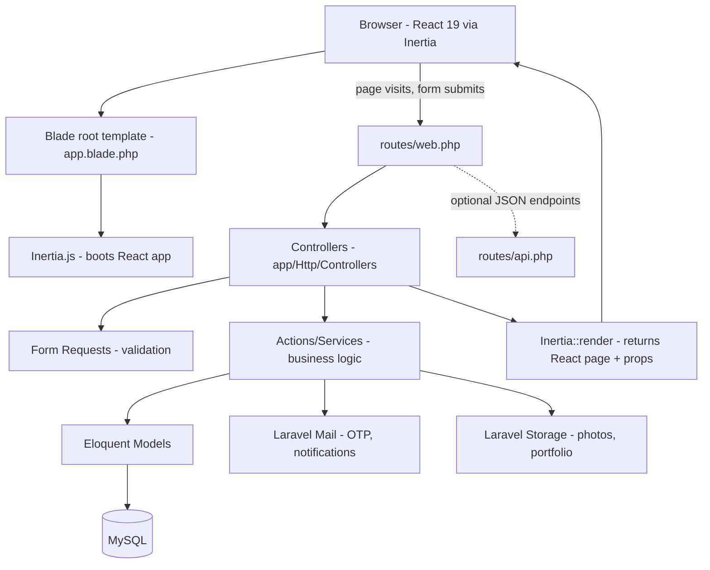
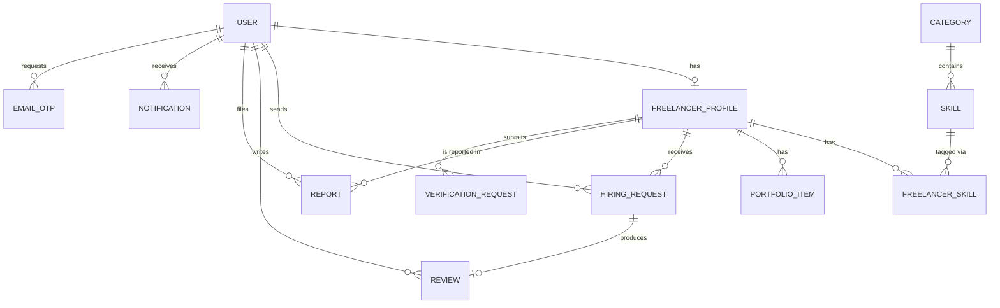

# Technical Specification — Hireskills

Answers: How should the application be built?
Depends on: Product Specification
Status legend: Confirmed (locked by product owner / instructor requirement), Recommendation (proposed baseline for building, open to change)

Constraints driving every choice below: instructor requires the latest Laravel version; development is solo/AI-assisted in Cursor, using Laravel Herd for local hosting; no paid services or paid software; web-only, mobile-first responsive; session-based auth; English-only interface; hundreds-to-low-thousands scale.

---

## 1. Technology Stack

| Layer                                     | Choice                                                                                                                               | Status                                            | Why                                                                                                                                                                                                                                                                                                                                                                                                                                                                                                                                                                                                                                                                                                              |
| ----------------------------------------- | ------------------------------------------------------------------------------------------------------------------------------------ | ------------------------------------------------- | ---------------------------------------------------------------------------------------------------------------------------------------------------------------------------------------------------------------------------------------------------------------------------------------------------------------------------------------------------------------------------------------------------------------------------------------------------------------------------------------------------------------------------------------------------------------------------------------------------------------------------------------------------------------------------------------------------------------- |
| Backend framework                         | Laravel 13 (PHP 8.3+)                                                                                                                | Confirmed                                         | Instructor requirement — latest Laravel major as of this project                                                                                                                                                                                                                                                                                                                                                                                                                                                                                                                                                                                                                                                 |
| Local dev environment                     | Laravel Herd                                                                                                                         | Confirmed                                         | Product owner's chosen tool — free, handles PHP/Nginx/local domains without manual setup                                                                                                                                                                                                                                                                                                                                                                                                                                                                                                                                                                                                                         |
| Starter kit                               | `laravel/react-starter-kit` (installed via `laravel new`, frontend stack = react, auth provider = Laravel's built-in authentication) | Confirmed                                         | Product owner's actual setup. Auth provider choice was "Laravel's built-in authentication" over "WorkOS" — correct choice, since WorkOS is a paid third-party auth service and would have violated the no-paid-services constraint.                                                                                                                                                                                                                                                                                                                                                                                                                                                                              |
| Frontend framework                        | Inertia.js v3 + React 19 + TypeScript                                                                                                | Confirmed                                         | Gives an SPA feel without building a separate REST API or maintaining two codebases                                                                                                                                                                                                                                                                                                                                                                                                                                                                                                                                                                                                                              |
| Root template                             | Blade (single root `app.blade.php`)                                                                                                  | Confirmed                                         | Standard Inertia setup — Blade renders one shell page; Inertia/React renders everything inside it. Blade is not used for individual pages.                                                                                                                                                                                                                                                                                                                                                                                                                                                                                                                                                                       |
| Styling                                   | Tailwind CSS v4                                                                                                                      | Confirmed                                         | Ships pre-configured with the starter kit                                                                                                                                                                                                                                                                                                                                                                                                                                                                                                                                                                                                                                                                        |
| Component primitives                      | shadcn-style components (ships with the starter kit)                                                                                 | Confirmed                                         | Already wired into the starter kit — no separate setup                                                                                                                                                                                                                                                                                                                                                                                                                                                                                                                                                                                                                                                           |
| Auth backend                              | Laravel Fortify                                                                                                                      | Confirmed                                         | Installed as a dependency by the starter kit (`laravel/fortify` present in composer install). Provides login, registration, logout, and password reset out of the box, with existing `App\Actions\Fortify\*` action classes to extend. Email verification is customized for OTP — see Section 4.                                                                                                                                                                                                                                                                                                                                                                                                                 |
| Auth features scaffolded but out of scope | Two-factor authentication, Passkeys (WebAuthn), Password confirmation                                                                | Confirmed present, not used                       | The starter kit installs `laravel/passkeys` and two-factor columns on `users` by default and offers these as togglable features during setup. None of these are in the PRD or Product Spec — leave the underlying code present but do not build UI or routes exposing them. Do not enable by default.                                                                                                                                                                                                                                                                                                                                                                                                            |
| Teams support                             | Declined during setup                                                                                                                | Confirmed                                         | Correct choice — matches the one-role-per-account, no-multi-tenancy model in Product Spec Section 5                                                                                                                                                                                                                                                                                                                                                                                                                                                                                                                                                                                                              |
| Type-safe routing                         | Laravel Wayfinder                                                                                                                    | Confirmed                                         | Installed by the starter kit; generates typed route/controller references for the React side, reducing hardcoded URL strings                                                                                                                                                                                                                                                                                                                                                                                                                                                                                                                                                                                     |
| AI coding tooling                         | Laravel Boost                                                                                                                        | Confirmed, installed                              | A separate dev-only package the product owner installed via `laravel new`'s Boost prompt, configured for the Cursor agent. Auto-generates AI guidelines and 7 "skills" (fortify-development, inertia-react-development, infer-conventions, laravel-best-practices, tailwindcss-development, testing-best-practices, wayfinder-development) plus MCP server config for Cursor. This is a generic, stack-level complement to AI-DEV-CONTEXT.md, not a replacement — Boost teaches Cursor how this stack works in general; AI-DEV-CONTEXT.md teaches it what this specific product must do. Run Boost's `infer-conventions` skill once real code exists, to sharpen future generations against the actual codebase. |
| Dev tooling included but unused           | Laravel Sail (Docker)                                                                                                                | Confirmed present, not used                       | Installed by default; the product owner uses Herd instead, so Sail can be ignored                                                                                                                                                                                                                                                                                                                                                                                                                                                                                                                                                                                                                                |
| Log viewer                                | Laravel Pail                                                                                                                         | Confirmed, installed                              | `php artisan pail` for readable local log tailing — free, ships with the starter kit                                                                                                                                                                                                                                                                                                                                                                                                                                                                                                                                                                                                                             |
| ORM                                       | Eloquent (built into Laravel)                                                                                                        | Confirmed                                         | Laravel's native ORM — no separate choice to make                                                                                                                                                                                                                                                                                                                                                                                                                                                                                                                                                                                                                                                                |
| Database                                  | SQLite for local development, MySQL for any real deployment                                                                          | Confirmed default / Recommendation for production | See the revised database strategy in Section 3.4 — the project already runs on SQLite by default with migrations applied successfully.                                                                                                                                                                                                                                                                                                                                                                                                                                                                                                                                                                           |
| Password hashing                          | Laravel's `Hash` facade (bcrypt by default)                                                                                          | Confirmed                                         | Built into Laravel, no extra dependency                                                                                                                                                                                                                                                                                                                                                                                                                                                                                                                                                                                                                                                                          |
| Email (OTP, notifications)                | Laravel Mail + a free SMTP provider                                                                                                  | Recommendation                                    | Needed for FR-042 email OTP; exact provider is an open decision — see Section 9                                                                                                                                                                                                                                                                                                                                                                                                                                                                                                                                                                                                                                  |
| File storage                              | Laravel `Storage` facade, local disk driver                                                                                          | Recommendation                                    | Zero cost, simplest for v1 scale; symlinked to `public/storage`                                                                                                                                                                                                                                                                                                                                                                                                                                                                                                                                                                                                                                                  |
| Package managers                          | Composer (PHP), npm (JS)                                                                                                             | Confirmed                                         | Standard for this stack                                                                                                                                                                                                                                                                                                                                                                                                                                                                                                                                                                                                                                                                                          |
| Build tool                                | Vite                                                                                                                                 | Confirmed                                         | Ships with the starter kit, compiles the React/TypeScript frontend                                                                                                                                                                                                                                                                                                                                                                                                                                                                                                                                                                                                                                               |
| Dev startup                               | `composer run dev`                                                                                                                   | Confirmed                                         | The starter kit's built-in script; runs the Laravel server, queue listener, and Vite dev server together                                                                                                                                                                                                                                                                                                                                                                                                                                                                                                                                                                                                         |
| Testing                                   | Pest (backend unit/feature/browser tests)                                                                                            | Confirmed, scaffolded                             | Ships with the starter kit (`pestphp/pest-plugin-laravel`, plus a browser-testing plugin); its browser plugin covers end-to-end testing without adding a separate tool                                                                                                                                                                                                                                                                                                                                                                                                                                                                                                                                           |
| Deployment                                | Self-hosted (VPS) or a provider's free tier                                                                                          | Recommendation                                    | Out of scope for this document; revisit when ready to ship                                                                                                                                                                                                                                                                                                                                                                                                                                                                                                                                                                                                                                                       |

Everything marked Recommendation is still open to change; Confirmed rows reflect either an explicit product owner decision or what the actual `laravel new` scaffolding produced.

## 2. Architecture Overview

Monolithic Laravel application using Inertia to serve a React frontend without a separate API layer for most pages. One codebase, one deployable unit.



Layers:

- **routes/web.php** — page and form routes, matching the route table in the Product Specification. Most routes return `Inertia::render('PageName', [...props])` or redirect back with flashed data, exactly like a normal Laravel app — Inertia intercepts these on the frontend to avoid full page reloads.
- **routes/api.php** — reserved for the small number of interactions that genuinely need a JSON response without a full Inertia page visit (see Section 5.10).
- **Controllers** — thin; validate via Form Requests, call into Actions, return an Inertia response or redirect.
- **Form Requests** (`app/Http/Requests`) — one per form, holding validation rules. This is Laravel's native equivalent of a shared Zod schema.
- **Actions/Services** (`app/Actions` or `app/Services`) — plain PHP classes holding business logic: the Hiring Request state machine, ranking, reputation recalculation. Keeps controllers thin and logic independently testable.
- **Eloquent Models** — one per entity in Section 3, holding relationships and any model-level constants (e.g. valid state values).
- **Policies** (`app/Policies`) — Laravel's native authorization mechanism, used for per-record checks (e.g. "only this request's Freelancer can accept it").

## 3. Database Design

### 3.1 Entity Relationship Diagram



### 3.2 Schema

Primary keys use Laravel's default auto-increment `id()` (bigint) rather than UUIDs — the idiomatic Eloquent default, simpler for a project this size, with no requirement for non-guessable public IDs. Each table below corresponds to one migration and one Eloquent model.

**users**

| Field                  | Type                                 | Notes                                                                                                                                                                         |
| ---------------------- | ------------------------------------ | ----------------------------------------------------------------------------------------------------------------------------------------------------------------------------- |
| id                     | bigint, PK                           | Laravel default                                                                                                                                                               |
| role                   | enum: freelancer, employer, admin    | Fixed at creation, never changed                                                                                                                                              |
| name                   | string                               | Required                                                                                                                                                                      |
| email                  | string, unique                       | Required                                                                                                                                                                      |
| email_verified_at      | timestamp, nullable                  | Null until OTP confirmed (FR-042). Laravel's `MustVerifyEmail` contract uses this same column, but the verification mechanism is replaced with an OTP code — see Section 4.2. |
| phone                  | string                               | Required, contact field only, not verified in v1                                                                                                                              |
| password               | string                               | Hashed via `Hash::make()`, never plaintext                                                                                                                                    |
| municipality           | string                               | Required                                                                                                                                                                      |
| barangay               | string                               | Required                                                                                                                                                                      |
| status                 | enum: active, suspended, deactivated | Default active                                                                                                                                                                |
| created_at, updated_at | timestamp                            | Laravel default timestamps                                                                                                                                                    |

**email_otps**

| Field       | Type                | Notes                                       |
| ----------- | ------------------- | ------------------------------------------- |
| id          | bigint, PK          |                                             |
| user_id     | FK → users          |                                             |
| code_hash   | string              | Hashed OTP code, never stored plain         |
| expires_at  | timestamp           |                                             |
| consumed_at | timestamp, nullable | Null until used                             |
| created_at  | timestamp           | For rate-limiting resend requests (NFR-007) |

**freelancer_profiles**

| Field                  | Type                                                                        | Notes                                                                   |
| ---------------------- | --------------------------------------------------------------------------- | ----------------------------------------------------------------------- |
| id                     | bigint, PK                                                                  |                                                                         |
| user_id                | FK → users, unique                                                          | One-to-one                                                              |
| photo_path             | string, nullable                                                            | Path under Laravel Storage                                              |
| introduction           | text, nullable                                                              |                                                                         |
| availability_status    | enum: available, unavailable, specific_days                                 | FR-011                                                                  |
| pricing_mode           | enum: starting_price, price_range, hourly, per_project, contact_for_pricing | FR-012                                                                  |
| price_min              | decimal(10,2), nullable                                                     |                                                                         |
| price_max              | decimal(10,2), nullable                                                     |                                                                         |
| experience_years       | unsigned integer, nullable                                                  |                                                                         |
| is_published           | boolean                                                                     | Default false; true only after checks in FR-006/BR-004 pass             |
| rating_avg             | decimal(3,2), nullable                                                      | System-derived (BR-006)                                                 |
| rating_count           | unsigned integer                                                            | Default 0                                                               |
| completed_jobs_count   | unsigned integer                                                            | Default 0, system-derived from Completed requests                       |
| clients_count          | unsigned integer                                                            | Default 0, system-derived (distinct employers with a Completed request) |
| contact_channels       | json, nullable                                                              | e.g. `{"messenger": "...", "sms": "...", "gmail": "..."}`               |
| identity_verified_at   | timestamp, nullable                                                         | Enhanced verification badge (FR-044)                                    |
| created_at, updated_at | timestamp                                                                   |                                                                         |

**categories**

| Field     | Type           | Notes                        |
| --------- | -------------- | ---------------------------- |
| id        | bigint, PK     |                              |
| name      | string         |                              |
| slug      | string, unique | Used in `/categories/{slug}` |
| is_active | boolean        | Default true                 |

**skills**

| Field               | Type                    | Notes                                                |
| ------------------- | ----------------------- | ---------------------------------------------------- |
| id                  | bigint, PK              |                                                      |
| category_id         | FK → categories         |                                                      |
| name                | string                  |                                                      |
| slug                | string                  |                                                      |
| status              | enum: approved, pending | Pending = "Other" submission awaiting Admin (BR-007) |
| proposed_by_user_id | FK → users, nullable    | Null for seeded skills                               |

**freelancer_skill** (pivot table)

| Field                 | Type                     | Notes                                   |
| --------------------- | ------------------------ | --------------------------------------- |
| freelancer_profile_id | FK → freelancer_profiles | Composite PK with skill_id              |
| skill_id              | FK → skills              | Composite PK with freelancer_profile_id |

**portfolio_items**

| Field                 | Type                     | Notes                                             |
| --------------------- | ------------------------ | ------------------------------------------------- |
| id                    | bigint, PK               |                                                   |
| freelancer_profile_id | FK → freelancer_profiles |                                                   |
| image_path            | string                   | JPG/PNG only (FR-029), path under Laravel Storage |
| caption               | string, nullable         |                                                   |
| created_at            | timestamp                |                                                   |

**hiring_requests**

| Field                  | Type                                                                                           | Notes                                         |
| ---------------------- | ---------------------------------------------------------------------------------------------- | --------------------------------------------- |
| id                     | bigint, PK                                                                                     |                                               |
| employer_id            | FK → users                                                                                     |                                               |
| freelancer_profile_id  | FK → freelancer_profiles                                                                       |                                               |
| service_needed         | string                                                                                         |                                               |
| preferred_date         | date, nullable                                                                                 |                                               |
| location               | string                                                                                         |                                               |
| pricing_mode           | enum, same values as freelancer_profiles.pricing_mode                                          |                                               |
| message                | text                                                                                           | Single field, no reply thread (FR-032)        |
| state                  | enum: submitted, pending_response, request_more_info, accepted, declined, completed, cancelled | BR-001                                        |
| completed_marked_at    | timestamp, nullable                                                                            | Employer's Completed mark                     |
| completed_confirmed_at | timestamp, nullable                                                                            | Freelancer confirmation or 7-day auto-confirm |
| created_at, updated_at | timestamp                                                                                      |                                               |

**reviews**

| Field                  | Type                         | Notes                                    |
| ---------------------- | ---------------------------- | ---------------------------------------- |
| id                     | bigint, PK                   |                                          |
| hiring_request_id      | FK → hiring_requests, unique | Enforces one review per request (FR-037) |
| employer_id            | FK → users                   |                                          |
| freelancer_profile_id  | FK → freelancer_profiles     |                                          |
| rating                 | unsigned tinyint, 1–5        | FR-039                                   |
| comment                | text, nullable               |                                          |
| created_at, updated_at | timestamp                    |                                          |

**reports**

| Field                 | Type                                              | Notes  |
| --------------------- | ------------------------------------------------- | ------ |
| id                    | bigint, PK                                        |        |
| reporter_user_id      | FK → users                                        |        |
| freelancer_profile_id | FK → freelancer_profiles                          |        |
| reason                | string                                            |        |
| details               | text, nullable                                    |        |
| status                | enum: open, dismissed, warned, suspended, removed | FR-051 |
| resolved_by_admin_id  | FK → users, nullable                              |        |
| resolved_at           | timestamp, nullable                               |        |
| created_at            | timestamp                                         |        |

**notifications**

Note: Laravel ships a built-in Notification system with its own default table shape. Recommendation: use a custom `notifications` table (below) rather than Laravel's default notifications table, since the product's read/unread and in-app-only behavior is simpler to model directly than to fit into Laravel's polymorphic default schema.

| Field      | Type       | Notes                                                                    |
| ---------- | ---------- | ------------------------------------------------------------------------ |
| id         | bigint, PK |                                                                          |
| user_id    | FK → users | Recipient                                                                |
| type       | string     | e.g. profile_viewed, request_received, request_accepted, review_received |
| payload    | json       | Context data for rendering (e.g. related request id)                     |
| is_read    | boolean    | Default false (FR-048)                                                   |
| created_at | timestamp  |                                                                          |

**verification_requests**

| Field                 | Type                              | Notes  |
| --------------------- | --------------------------------- | ------ |
| id                    | bigint, PK                        |        |
| freelancer_profile_id | FK → freelancer_profiles          |        |
| type                  | enum: identity, certification     | FR-043 |
| file_path             | string                            |        |
| status                | enum: pending, approved, rejected |        |
| reviewed_by_admin_id  | FK → users, nullable              |        |
| reviewed_at           | timestamp, nullable               |        |
| created_at            | timestamp                         |        |

### 3.3 Indexes

- users.email — unique index.
- freelancer_profiles.is_published — indexed, filters every discovery/search query.
- hiring_requests.employer_id, hiring_requests.freelancer_profile_id, hiring_requests.state — indexed.
- skills.category_id, freelancer_skill (both FK columns) — indexed, used by search/filter matching.
- notifications.user_id, notifications.is_read — indexed.

### 3.4 Database Strategy: SQLite, MySQL, or PostgreSQL

This is revised from an earlier draft, now that the actual project scaffold is known: `laravel new` defaulted to **SQLite**, and it's already migrated and running under Herd. That changes the practical recommendation.

**Local development and coursework: keep SQLite.** It's genuinely zero-configuration — a single file, no server process to install or manage, nothing to break between machines, and it's what's already working. For a project at this scale (hundreds to low thousands of users, a single-server deployment, no concurrent-write-heavy workload), SQLite is not a toy choice — it comfortably handles this app's actual load. Every schema decision in Section 3.2 works on SQLite: Eloquent's `enum()` migration helper compiles to a `CHECK` constraint (same as it would on PostgreSQL), and SQLite has a native JSON extension covering the `contact_channels` and `notifications.payload` columns. Unless a specific reason to move off it comes up, there's no need to.

**If and when this needs a real deployment target, then decide between MySQL and PostgreSQL — not before.** The earlier MySQL recommendation still applies if you end up on typical shared/cPanel-style hosting (most of those support MySQL/MariaDB, far fewer support PostgreSQL). PostgreSQL is the better call specifically if the deployment target is a free serverless Postgres host (Supabase, Neon) rather than traditional hosting. Both are one `.env` change plus re-running migrations — Eloquent's query builder abstracts almost all of the difference, so this is not a decision that needs to be made now.

**Practical note:** SQLite has a couple of real limitations worth knowing before they surprise you — it doesn't enforce column-level `VARCHAR` length limits (Laravel's `string()` migration still validates length at the application layer via Form Requests, so this isn't a functional gap, just a difference in where the constraint lives), and it handles concurrent writes more conservatively than a client-server database (a non-issue at this project's scale, but worth knowing if load testing is ever part of the coursework).

## 4. Authentication and Authorization

### 4.1 Session Model

- Session-based auth via Laravel's built-in session guard — the framework default, no extra library needed (NFR-008). No JWT.
- Confirmed: "Laravel's built-in authentication" was selected during `laravel new` setup, over WorkOS. Under the hood this is Laravel Fortify (`laravel/fortify` is an installed dependency), providing the registration, login, and logout actions out of the box, wired to Inertia via the starter kit.
- The starter kit already scaffolds `App\Actions\Fortify\CreateNewUser`, `ResetUserPassword`, `UpdateUserPassword`, and `UpdateUserProfileInformation` — extend `CreateNewUser` to accept role, phone, municipality, and barangay, and to create the matching `FreelancerProfile` row when role = freelancer, rather than writing registration from scratch.
- CSRF protection is automatic — Laravel's `VerifyCsrfToken` middleware plus Inertia's Axios instance handle the token exchange without manual wiring.

### 4.2 Registration and Email Verification (OTP)

- Fortify's default email verification is a clickable magic link, which does not match the OTP-code UI established for this product (FR-042). Recommendation: override Fortify's verification flow with a custom implementation:
    - A `EmailOtp` row is created on registration with a hashed 6-digit code and a short expiry (Recommendation: 10 minutes), sent via a Mailable.
    - A custom middleware (parallel to Laravel's built-in `EnsureEmailIsVerified`) blocks access to any protected route until `users.email_verified_at` is set.
    - `/email/verify-otp` and `/email/resend-otp` routes replace Fortify's default link-based verification routes.
- Resend is rate-limited (Recommendation: 1 request per 60 seconds, max 5 per hour) using Laravel's built-in `RateLimiter`.

### 4.2a Scaffolded Features Out of Scope

The starter kit's setup step offers Email Verification, Registration, Two-Factor Authentication, Passkeys, and Password Confirmation as togglable features, and installs the `laravel/passkeys` package and two-factor columns on `users` regardless. Only Registration and Email Verification (customized per 4.2) and standard password-based login are in scope per the Product Specification — no feature in this project calls for 2FA or passkeys. Leave the underlying scaffolding in place (removing it risks breaking the starter kit's other wiring) but do not build any UI, route, or nav entry that exposes 2FA or passkey setup to users.

### 4.3 Password Reset

- Fortify's default password reset flow (token emailed, single-use, expiring) is used largely as-is — no customization needed here, unlike email verification.
- Recommendation: resetting a password logs the user out of all other sessions, using Laravel's `Auth::logoutOtherDevices()`.

### 4.4 Authorization Matrix

| Resource / Action                               | Guest |             Freelancer |                               Employer | Admin |
| ----------------------------------------------- | ----: | ---------------------: | -------------------------------------: | ----: |
| View discovery feed, search, filter             |   Yes |                    Yes |                                    Yes |   Yes |
| View freelancer profile (minus contact details) |   Yes |                    Yes |                                    Yes |   Yes |
| View freelancer contact details                 |    No |                     No |                       Yes, if verified |   Yes |
| Edit own freelancer profile                     |    No |          Yes, own only |                                     No |    No |
| Send Hiring Request                             |    No |                     No |                       Yes, if verified |    No |
| Respond to Hiring Request                       |    No | Yes, own received only |                                     No |    No |
| Submit / edit / delete Review                   |    No |                     No | Yes, own only, Completed requests only |    No |
| Report a profile                                |    No |                    Yes |                                    Yes |    No |
| Manage categories/skills                        |    No |                     No |                                     No |   Yes |
| Resolve reports                                 |    No |                     No |                                     No |   Yes |
| Review verification submissions                 |    No |                     No |                                     No |   Yes |
| Suspend/reactivate accounts                     |    No |                     No |                                     No |   Yes |

Enforcement mechanism: route-level middleware checks role (e.g. `role:freelancer`, `role:employer`, `role:admin`), and Laravel Policies (`app/Policies`) enforce per-record ownership — e.g. `HiringRequestPolicy::accept()` checks that the authenticated Freelancer owns the specific request before allowing the action, regardless of what the client sends.

## 5. Routes and Controllers

Inertia apps don't expose a separate JSON REST API for most interactions — a route returns `Inertia::render()` for a page visit, or redirects back (with flashed session data / validation errors) for a form submission, and the frontend's Inertia adapter handles the rest without a full page reload. The tables below list routes grouped by resource, in `Method | Route | Controller@action | Response | Purpose` form. All routes live in `routes/web.php` unless noted otherwise.

### 5.1 Auth

| Method    | Route                | Controller@Action                     | Response                     | Purpose                   |
| --------- | -------------------- | ------------------------------------- | ---------------------------- | ------------------------- |
| GET       | /register            | RegisterController@create             | Inertia page                 | Role selection (FR-001)   |
| POST      | /register/freelancer | FreelancerRegisteredController@store  | Redirect to /verify-email    | Create Freelancer account |
| POST      | /register/employer   | EmployerRegisteredController@store    | Redirect to /verify-email    | Create Employer account   |
| GET       | /verify-email        | EmailOtpController@show               | Inertia page                 | OTP entry screen          |
| POST      | /email/verify-otp    | EmailOtpController@verify             | Redirect to role home        | Confirm OTP (FR-042)      |
| POST      | /email/resend-otp    | EmailOtpController@resend             | Redirect back, flash message | Resend OTP, rate-limited  |
| GET       | /login               | Fortify default                       | Inertia page                 | Login form                |
| POST      | /login               | Fortify default (customized redirect) | Redirect to role home        | Session login             |
| POST      | /logout              | Fortify default                       | Redirect to /                | Clear session             |
| GET, POST | /forgot-password     | Fortify default                       | Inertia page / redirect      | Request reset             |
| GET, POST | /reset-password      | Fortify default                       | Inertia page / redirect      | Set new password          |

### 5.2 Freelancer Profile

| Method | Route                       | Controller@Action                   | Response                                   | Purpose                                               |
| ------ | --------------------------- | ----------------------------------- | ------------------------------------------ | ----------------------------------------------------- |
| GET    | /freelancer/profile/edit    | FreelancerProfileController@edit    | Inertia page                               | Load own profile for editing                          |
| PUT    | /freelancer/profile         | FreelancerProfileController@update  | Redirect back                              | Update basic/professional info, availability, pricing |
| PUT    | /freelancer/profile/skills  | FreelancerSkillController@update    | Redirect back                              | Set categories/skills, submit "Other" proposal        |
| POST   | /freelancer/profile/publish | FreelancerProfileController@publish | Redirect back, flash errors if checks fail | Run FR-006/BR-004 checks, flip is_published           |
| GET    | /freelancer/profile/preview | FreelancerProfileController@preview | Inertia page                               | Self-view of public profile                           |

### 5.3 Portfolio

| Method | Route                                 | Controller@Action           | Response      | Purpose                   |
| ------ | ------------------------------------- | --------------------------- | ------------- | ------------------------- |
| POST   | /freelancer/portfolio                 | PortfolioController@store   | Redirect back | Upload item, JPG/PNG only |
| DELETE | /freelancer/portfolio/{portfolioItem} | PortfolioController@destroy | Redirect back | Remove item               |

### 5.4 Discovery

| Method | Route                     | Controller@Action             | Response     | Purpose                                                         |
| ------ | ------------------------- | ----------------------------- | ------------ | --------------------------------------------------------------- |
| GET    | /                         | HomeController@index          | Inertia page | Ranked Live profiles (FEAT-06)                                  |
| GET    | /search                   | SearchController@index        | Inertia page | Query-based results (FEAT-07)                                   |
| GET    | /categories               | CategoryController@index      | Inertia page | Fixed category list                                             |
| GET    | /categories/{category}    | CategoryController@show       | Inertia page | Filtered listing                                                |
| GET    | /freelancers/{freelancer} | FreelancerShowController@show | Inertia page | Full profile; contact fields conditionally included server-side |

Search and filtering (FEATURE-009, FEATURE-010) share the same controller pattern — query string parameters (`q`, `category`, `skill`, `municipality`, `barangay`, `min_experience`, `min_rating`) are accepted by both `HomeController@index` and `SearchController@index`.

### 5.5 Contact

| Method | Route                             | Controller@Action       | Response                                                          | Purpose                                                       |
| ------ | --------------------------------- | ----------------------- | ----------------------------------------------------------------- | ------------------------------------------------------------- |
| POST   | /freelancers/{freelancer}/contact | ContactController@store | Inertia partial reload or redirect back with contact data flashed | Reveal contact channel(s), notify freelancer (FR-030, FR-045) |

### 5.6 Hiring Requests

| Method | Route                                      | Controller@Action                       | Response                   | Purpose                                       |
| ------ | ------------------------------------------ | --------------------------------------- | -------------------------- | --------------------------------------------- |
| POST   | /requests                                  | HiringRequestController@store           | Redirect to request detail | Create request, state = submitted             |
| GET    | /requests                                  | HiringRequestController@index           | Inertia page               | List own requests (received or sent, by role) |
| GET    | /requests/{hiringRequest}                  | HiringRequestController@show            | Inertia page               | Request detail                                |
| POST   | /requests/{hiringRequest}/accept           | HiringRequestController@accept          | Redirect back              | Freelancer accepts                            |
| POST   | /requests/{hiringRequest}/decline          | HiringRequestController@decline         | Redirect back              | Freelancer declines                           |
| POST   | /requests/{hiringRequest}/request-info     | HiringRequestController@requestInfo     | Redirect back              | Freelancer requests clarification             |
| POST   | /requests/{hiringRequest}/complete         | HiringRequestController@complete        | Redirect back              | Employer marks Completed                      |
| POST   | /requests/{hiringRequest}/confirm-complete | HiringRequestController@confirmComplete | Redirect back              | Freelancer confirms                           |
| POST   | /requests/{hiringRequest}/cancel           | HiringRequestController@cancel          | Redirect back              | Either party cancels                          |

Every action route is authorized via `HiringRequestPolicy` and validated against the state machine inside an Action class (`app/Actions/HiringRequest/...`), not inline in the controller. An invalid transition throws a domain exception caught and returned as a 409-equivalent Inertia error/flash message.

### 5.7 Reviews

| Method | Route             | Controller@Action        | Response      | Purpose                    |
| ------ | ----------------- | ------------------------ | ------------- | -------------------------- |
| POST   | /reviews          | ReviewController@store   | Redirect back | Create review (FR-036–039) |
| PUT    | /reviews/{review} | ReviewController@update  | Redirect back | Edit own review            |
| DELETE | /reviews/{review} | ReviewController@destroy | Redirect back | Delete own review          |

Review lists are included as props on the profile page (`FreelancerShowController@show`) and the reviews pages (`/freelancer/reviews`, `/employer/reviews`), not a separate route.

### 5.8 Reports

| Method | Route    | Controller@Action      | Response                          | Purpose                        |
| ------ | -------- | ---------------------- | --------------------------------- | ------------------------------ |
| POST   | /reports | ReportController@store | Redirect back, flash confirmation | File a report (FR-049, FR-050) |

### 5.9 Notifications

| Method | Route                              | Controller@Action               | Response                                | Purpose                |
| ------ | ---------------------------------- | ------------------------------- | --------------------------------------- | ---------------------- |
| GET    | /notifications                     | NotificationController@index    | Inertia page                            | List own notifications |
| PATCH  | /notifications/{notification}/read | NotificationController@markRead | Redirect back or Inertia partial reload | Mark read              |

### 5.10 Lightweight JSON Endpoints (routes/api.php)

Two interactions benefit from a small JSON endpoint instead of a full Inertia visit, to avoid a jarring page-level reload for a frequent, minor update:

| Method | Route                           | Purpose                                                          |
| ------ | ------------------------------- | ---------------------------------------------------------------- |
| GET    | /api/notifications/unread-count | Poll for the nav badge count (FR-048) without reloading the page |

These use Laravel's session-based auth (same guard, `stateful` domains via Sanctum's session middleware, not token auth) — not a separate authentication mechanism. Keep this list short; default to Inertia routes unless a specific interaction needs it.

### 5.11 Admin

| Method | Route                                              | Controller@Action                   | Response      | Purpose                                    |
| ------ | -------------------------------------------------- | ----------------------------------- | ------------- | ------------------------------------------ |
| GET    | /admin                                             | AdminDashboardController@index      | Inertia page  | Overview                                   |
| GET    | /admin/users                                       | AdminUserController@index           | Inertia page  | List accounts                              |
| PATCH  | /admin/users/{user}/status                         | AdminUserController@updateStatus    | Redirect back | Suspend/reactivate                         |
| GET    | /admin/freelancers                                 | AdminFreelancerController@index     | Inertia page  | List profiles                              |
| GET    | /admin/freelancers/{freelancerProfile}             | AdminFreelancerController@show      | Inertia page  | Full profile + moderation actions          |
| GET    | /admin/categories                                  | AdminCategoryController@index       | Inertia page  | Taxonomy management                        |
| GET    | /admin/categories/pending                          | AdminSkillController@pending        | Inertia page  | Pending "Other" submissions                |
| POST   | /admin/categories/pending/{skill}/approve          | AdminSkillController@approve        | Redirect back | Approve submission                         |
| POST   | /admin/categories/pending/{skill}/reject           | AdminSkillController@reject         | Redirect back | Reject submission                          |
| GET    | /admin/reports                                     | AdminReportController@index         | Inertia page  | Reports queue                              |
| POST   | /admin/reports/{report}/resolve                    | AdminReportController@resolve       | Redirect back | Apply dismiss/warn/suspend/remove (FR-051) |
| GET    | /admin/verifications                               | AdminVerificationController@index   | Inertia page  | Pending identity/certification requests    |
| POST   | /admin/verifications/{verificationRequest}/approve | AdminVerificationController@approve | Redirect back | Approve, sets identity_verified_at         |
| POST   | /admin/verifications/{verificationRequest}/reject  | AdminVerificationController@reject  | Redirect back | Reject                                     |

### 5.12 Validation and Errors

- Each form-submitting route has a matching Form Request class (`app/Http/Requests`) holding its validation rules — Laravel's native equivalent of a shared Zod schema.
- Validation failures are handled automatically by Laravel/Inertia: the request redirects back with errors available to the React page via the `errors` prop and the `useForm()` hook — no custom error envelope needed for form submissions.
- Domain-level failures (e.g. an invalid Hiring Request state transition) are raised as custom exceptions in the Action layer and caught to produce a flashed error message, following the same redirect-back pattern.

## 6. Security

| Concern               | Approach                                                                                                                                                                        |
| --------------------- | ------------------------------------------------------------------------------------------------------------------------------------------------------------------------------- |
| Password storage      | Laravel's `Hash` facade (bcrypt), never plaintext (NFR-005)                                                                                                                     |
| Session security      | Laravel's default session guard, httpOnly signed cookies; no sensitive data readable client-side                                                                                |
| Input validation      | Form Request classes on every mutating route, server-side, never trusting client-side validation alone                                                                          |
| SQL injection         | Eloquent/Query Builder parameterizes all queries; no raw string-concatenated SQL                                                                                                |
| XSS                   | React escapes output by default; Blade is only used for the single root template, not user content                                                                              |
| CSRF                  | Handled automatically by Laravel's `VerifyCsrfToken` middleware plus Inertia's built-in token handling — no manual wiring needed                                                |
| File uploads          | Laravel validation rules (`mimes:jpg,png`, `max:...`) checked server-side against actual file content, not just the extension                                                   |
| Rate limiting         | Laravel's built-in `RateLimiter` / `throttle` middleware, applied to login, OTP request/resend, Hiring Request creation, and Report submission (NFR-007)                        |
| Contact info exposure | Contact fields are only included in `FreelancerShowController@show`'s Inertia props when the viewer is a verified, logged-in Employer or Admin — enforced server-side (NFR-006) |
| Admin surface         | `role:admin` middleware rejects any non-Admin session on every `/admin/*` route, not just a hidden UI element                                                                   |
| Secrets               | Stored in `.env`, never committed; `.env.example` documents required keys with placeholder values only                                                                          |
| Logging               | Laravel's log channels; no passwords, OTP codes, or session tokens ever logged                                                                                                  |

## 7. Project Structure

```
app/
  Actions/
    Fortify/                — already scaffolded: CreateNewUser, ResetUserPassword, UpdateUserPassword, UpdateUserProfileInformation. Extend, don't replace.
    HiringRequest/           — state machine transitions (Accept, Decline, Complete, Cancel, ...)
    Reputation/               — BR-006 recalculation logic
    Ranking/                  — FEATURE-018 ranking logic
  Http/
    Controllers/
      Auth/
      Freelancer/
      Admin/
      HiringRequestController.php
      ReviewController.php
      ReportController.php
      NotificationController.php
      ContactController.php
      HomeController.php, SearchController.php, CategoryController.php
    Requests/                — one Form Request class per form
    Middleware/               — role checks, forced email-verification-via-OTP gate
  Models/
    User.php, FreelancerProfile.php, Category.php, Skill.php, PortfolioItem.php,
    HiringRequest.php, Review.php, Report.php, Notification.php, VerificationRequest.php, EmailOtp.php
  Policies/
    HiringRequestPolicy.php, ReviewPolicy.php, FreelancerProfilePolicy.php
  Mail/
    EmailOtpMail.php
database/
  migrations/                 — includes the starter kit's own (users, cache, jobs, passkeys, two-factor columns) alongside this project's additions
  seeders/                    — seeds the fixed category/skill taxonomy
  factories/
  database.sqlite              — local dev database (already created and migrated)
routes/
  web.php
  api.php
resources/
  js/
    pages/
      public/                — Home, Search, Categories, FreelancerProfile, Register, Login, VerifyEmail
      freelancer/             — Dashboard, ProfileEdit, Skills, Portfolio, Preview, Requests, Reviews, Verification
      employer/               — Requests, Reviews
      admin/                  — Dashboard, Users, Freelancers, Categories, Reports, Verifications
    components/
      ui/                    — shared primitives from the starter kit (shadcn-style)
      discovery/
      profile/
      requests/
      reviews/
      admin/
    layouts/
      guest-layout.tsx, freelancer-layout.tsx, employer-layout.tsx, admin-layout.tsx
    types/
  css/
    app.css
  views/
    app.blade.php             — the single Inertia root template
tests/
  Feature/                    — one file per route group / feature
  Unit/                       — Actions and business logic
  Browser/                    — Pest browser tests (end-to-end), using the browser plugin already installed
public/
  storage -> ../storage/app/public   — symlink for uploaded files (php artisan storage:link)
```

Folder responsibilities:

- `resources/js/pages/` mirrors the access levels in Product Spec Section 4 — public, freelancer, employer, admin — matching the route groups on the backend. Lowercase folder naming matches what the starter kit actually scaffolds.
- `app/Actions/Fortify/` already exists from the starter kit install — this project's auth customization (Section 4) extends these files rather than building auth actions from scratch.
- `app/Actions/` (the rest) holds all business logic that isn't routing, validation, or presentation — reusable and independently testable via Pest unit tests.
- `app/Policies/` is where per-record authorization lives, kept out of controllers so it can't be quietly bypassed by a new route.

## 8. Local Development

Confirmed working setup, per the actual project scaffold:

- Laravel Herd handles PHP and the local web server automatically once the project is linked, serving the app at a `*.test` domain without manual Nginx/PHP configuration.
- Database: SQLite, already created (`database/database.sqlite`) and migrated — no separate database server install needed (Section 3.4).
- `composer run dev` starts the Laravel server, queue listener, and Vite dev server together — the single command to run while developing.
- `php artisan pail` gives a readable local log stream when debugging.
- Laravel Boost is already configured for Cursor — no additional setup needed to get its guidelines and skills active in this editor.

## 9. Open Items

- Email provider for sending OTPs needs a specific choice — Recommendation: start with a local mail-catching tool (Laravel's default `log` mail driver, or Mailpit if installed) during development, finalize a free SMTP provider before any real deployment.
- OTP expiry window (10 minutes) and resend rate limit (1/60s, 5/hour) are Recommendations, not yet confirmed.
- Whether to keep the single `/api/notifications/unread-count` JSON endpoint or fold it into a periodic Inertia partial reload instead is a minor Recommendation, not a hard requirement.
- Deployment target is still unknown — this decides whether Section 3.4's production database ends up MySQL or PostgreSQL. No need to resolve this until deployment is actually being planned.
